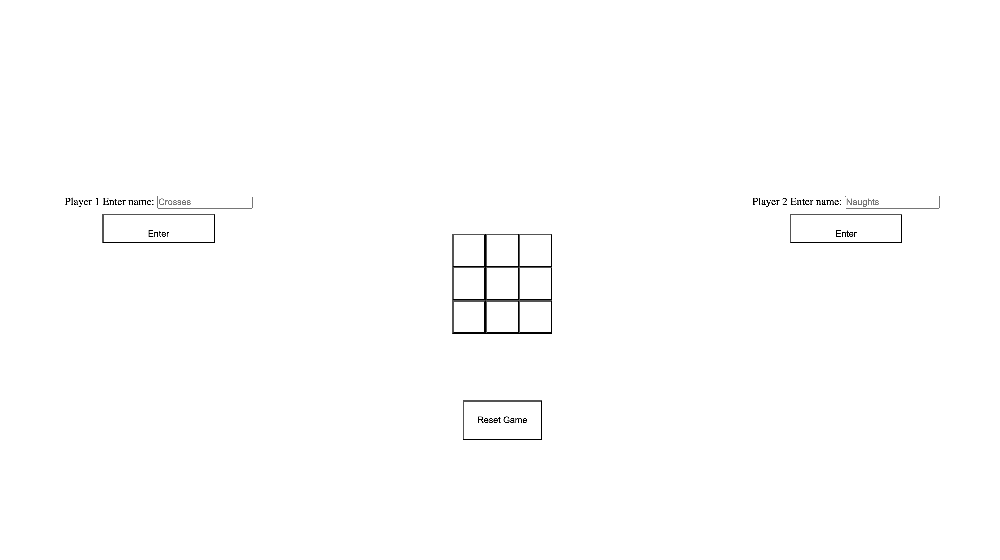
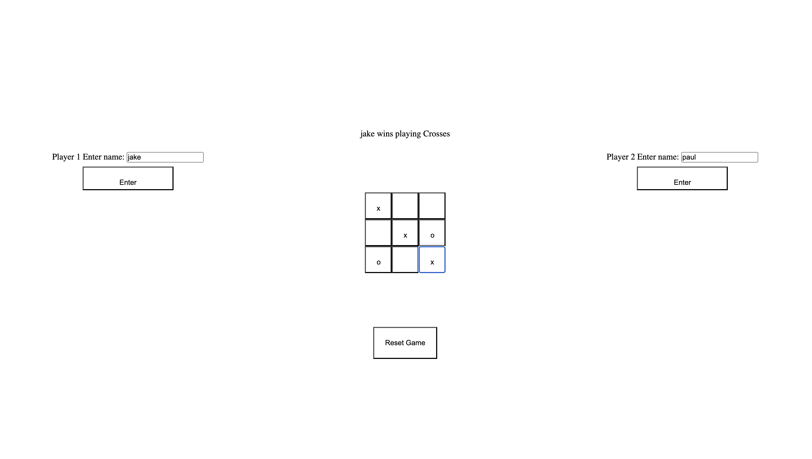

# JS-TICTAC

Welcome to the JS-TICTAC repository, this repository serves the purpose of practicing my javascript skills: more specifically the use of factory functions and IIFE's in javascript.

# To view the result

Follow this link - [JS-TICTAC](https://raimeiraikiri.github.io/JS-TICTAC/)

# About

- Tic-Tac-Toe was used as the vector to practice factory functions and IIFE's.
- This project was completed in line with the instructions for this project at this page [Odin tic-tac-toe project](https://www.theodinproject.com/lessons/node-path-javascript-tic-tac-toe)
- For the sake of efficiency, beauty and design was not a priority.

# Features

- Basic Tic-Tac-Toe functionality
- Displays winning player after game
- Start/Restart game button
- Enter names

# Result

The default look of the website:

Crosses win!:

# License

This project is licensed under the MIT License.
